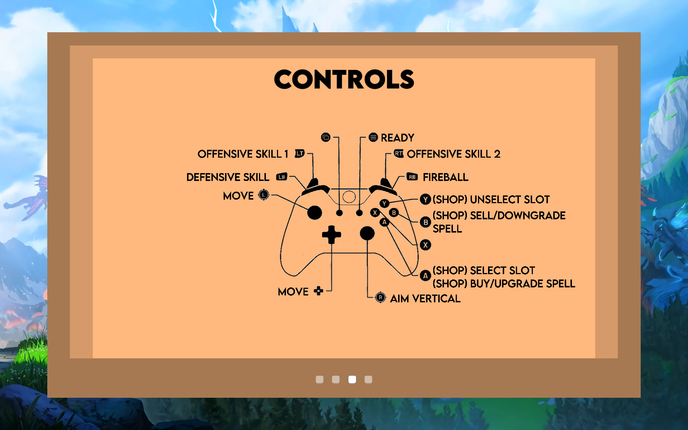

# *This Spells Trouble!*
By *Da Mages*

## Team Members
1. Kwa Li Ying
2. Nicholas Leu
3. Ng Jo-Shen
4. Soo Ming Wei
5. Koh Xian Ming

## Introduction
*This Spells Trouble!* is a is a 2D battle arena local multiplayer game where two to four players battle each other for five rounds and gain points if they are the last person standing in the arena. Unlike most MoBAs, players fight in a free-for-all mode on a shrinking platform surrounded by lava, aiming and casting spells in order to push each other off the platform and eliminate one another. After each round, players get to purchase, upgrade or sell spells in the spell selection menu, allowing them to mix and match their deadly arsenal as each round passes. As such, players are able to create combinations of spells that work well in tandem, creating their own playstyle which is different from others. At the end of all five rounds, the player with the most points wins.

## System Requirements
* Windows
* Only supports controller input (at the moment)

## How to Play the Game

### Game Description
Two to four players compete over a series of 5 rounds in a free-for-all, PvP environment as shown in the figure below, where their goal is to damage and knock other players off the shrinking platform and into the lava so that they can be the last person standing, gaining points if they are the last man standing. 

After each round, players can buy new spells, upgrade or sell existing spells, which may lead them to find good or interesting combinations that allow for chain attacks. The player with the highest total points at the end of the 5 rounds wins.

### Controls
The player controls are as shown in the figure below.

### More information about spells
* *Fireball* is the basic attack and it cannot be sold
* There is one defensive spell slot and two offensive spell slots 

## Inspirations
The mechanics of the game were mainly inspired by a map made for Warcraft 3, Warlock, which has been remade for both DotA2 and Warcraft 3 Reforged. The criteria for defeating players came from that of Nintendo’s Super Smash Brothers series. Player controls are loosely based on the controls in the popular MoBA mobile game, Brawl Stars.

## Asset Source Documentation
**Sprites & Textures** 
Characters:
https://foozlecc.itch.io/lucifer-4-direction-sorceress
https://foozlecc.itch.io/lucifer-4-direction-cultist-enemy
https://foozlecc.itch.io/lucifer-4-direction-possessed-enemy
https://foozlecc.itch.io/lucifer-4-direction-necromancer

Battle Skill Icons:
https://assetstore.unity.com/packages/2d/gui/icons/spellbook-preface-111069
https://assetstore.unity.com/packages/2d/gui/icons/basic-rpg-icons-181301
https://assetstore.unity.com/packages/2d/gui/icons/free-rpg-fantasy-spell-icons-200511

GUI:
https://assetstore.unity.com/packages/2d/gui/icons/simple-free-pixel-art-styled-ui-pack-165012

Screen Backgrounds:
https://preview.redd.it/in73r6sbixz31.png?width=4096&format=png&auto=webp&s=810fa4aef8f17b2ccf3ca4c18601eb731904d37e
https://www.artstation.com/artwork/nQ05E
https://graceliu.artstation.com/projects/BKPBD?album_id=644503

**Map Textures** 
https://assetstore.unity.com/packages/2d/environments/2d-magic-lands-set3-178895
https://assetstore.unity.com/packages/2d/environments/rpg-worlds-strange-land-194506
https://assetstore.unity.com/packages/2d/environments/rpg-worlds-snowy-lands-170339
https://assetstore.unity.com/packages/2d/environments/2d-magic-lands-set4-180422
https://assetstore.unity.com/packages/2d/environments/2d-magic-lands-dungeon-1-178896

**Spell Effects** 
https://assetstore.unity.com/packages/vfx/particles/spells/ky-magic-effects-free-21927

**Sound Effects** 
Maplestory:
https://drive.google.com/drive/folders/1SdRYfCdASj4Nx1OubCO0qobXqPqb0y4n
https://assetstore.unity.com/packages/audio/sound-fx/weapons/demo-ancient-magic-pack-free-175093

FF7:
https://mega.nz/file/A9ly1QSa#1nrzDeKBdn2aPHjzbPQPeF54fEHbmJRl8oQQNjtRVbQ

**Music**
FF7:
http://www.ffmages.com/final-fantasy-vii/original-soundtrack/

FF3:
https://fi.zophar.net/soundfiles/nintendo-nes-nsf/final-fantasy-iii/4%20-%20Fanfare%20%28Victory%20Fanfare%29.mp3

Smash Bros Melee:
https://open.spotify.com/track/66bDNbaPfFQw6PbuYlLj3F?si=78d7ae53028d469b
